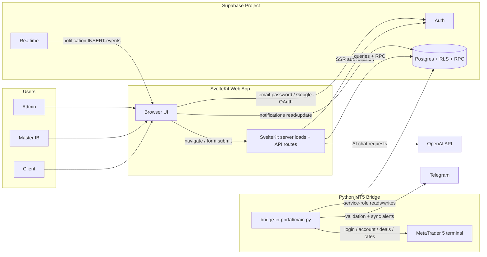
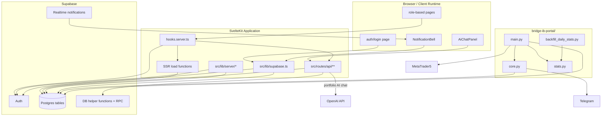
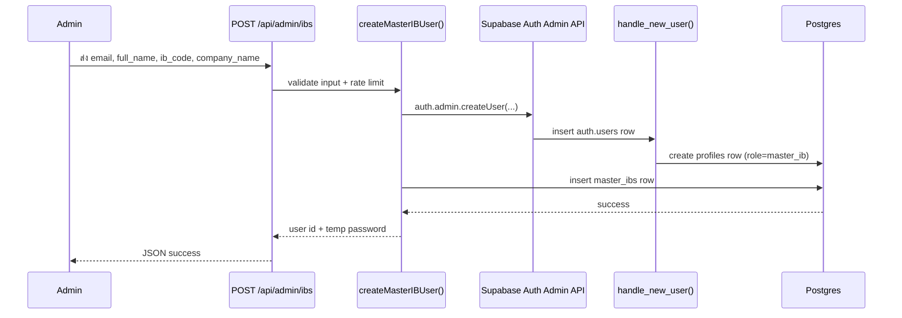
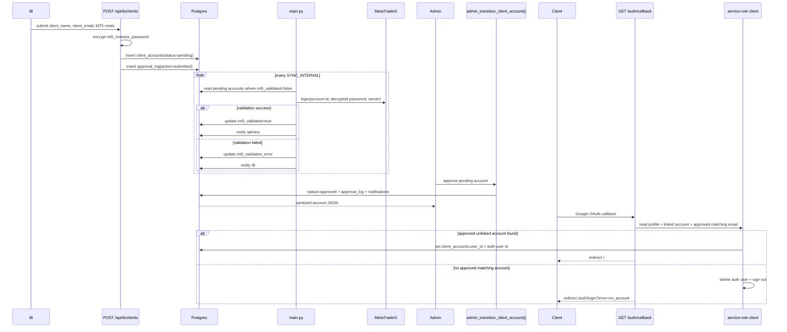
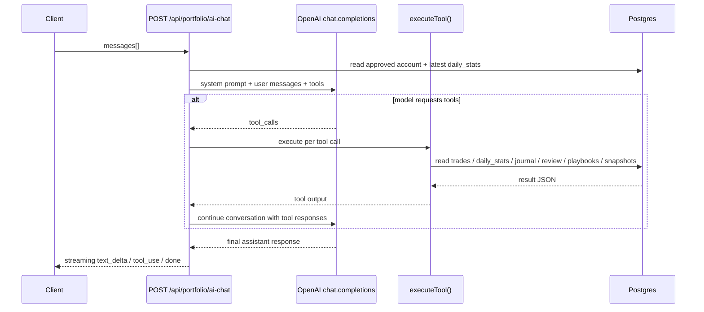

# Architecture

เอกสารหน้านี้สรุป current implementation ของระบบตามโค้ดใน repo ปัจจุบัน ไม่ใช่ target architecture หรือ proposal สำหรับ refactor ในอนาคต

## 1. System Context



## 2. Trust Boundaries

- Browser ใช้ `PUBLIC_SUPABASE_ANON_KEY` และ session cookie; จึงเห็นเฉพาะข้อมูลที่ RLS อนุญาต
- SvelteKit server ส่วนใหญ่ใช้ SSR Supabase client (`createSupabaseServerClient`) เพื่อ query ภายใต้ session ของ user
- บาง flow ใช้ service-role โดยตรงผ่าน `createSupabaseServiceClient()` เช่น admin dashboards, Master IB user creation, password reset และ OAuth account linking
- Python bridge ใช้ service-role key ทั้งหมดและ bypass RLS โดยตั้งใจ
- OpenAI API ถูกเรียกจาก server route เท่านั้น; browser ไม่ถือ API key
- Telegram เป็น outbound notification only; ไม่มี inbound control path กลับเข้าระบบ

## 3. Container View



## 4. Web Request Flow

### SSR / page load

1. Request เข้า `src/hooks.server.ts`
2. ระบบสร้าง SSR Supabase client จาก cookie
3. โหลด `session`, `user`, `profile`
4. ตรวจ route guard ตาม `profile.role`
5. เรียก `+layout.server.ts` หรือ `+page.server.ts`
6. Page loads query Supabase ผ่าน SSR client หรือ service-role client ตาม route

### Browser-only flow

- login page ใช้ browser Supabase client สำหรับ `signInWithPassword()` และ `signInWithOAuth()`
- `NotificationBell.svelte` query/update `notifications` และ subscribe Realtime โดยตรงจาก browser

## 5. Sequence: Admin Creates Master IB



จุดสำคัญ:

- profile ของ Master IB ไม่ได้สร้างจาก app code โดยตรง แต่สร้างผ่าน trigger บน `auth.users`
- ถ้า insert `master_ibs` ไม่สำเร็จ helper จะ rollback ด้วย `auth.admin.deleteUser()`

## 6. Sequence: IB Submit -> Validate -> Approve -> Client Links Google



จุดสำคัญ:

- approved client link ใช้ normalized email
- current implementation เลือก account แรกที่ `approved` และ `user_id IS NULL`
- unauthorized Google signups ถูกลบทิ้งจาก Supabase Auth ทันที

## 7. Sequence: Approved Account Sync Cycle

```mermaid
sequenceDiagram
    participant Loop as bridge main loop
    participant DB as Postgres
    participant MT5 as MetaTrader5
    participant Stats as recompute_daily_stats_for_account()

    loop every SYNC_INTERVAL
        Loop->>DB: select approved client_accounts
        Loop->>MT5: login with decrypted MT5 password
        alt login success
            Loop->>DB: upsert equity_snapshots (5-minute bucket)
            Loop->>DB: replace open_positions
            Loop->>MT5: history_deals_get()
            Loop->>DB: upsert trades by (client_account_id, position_id)
            Loop->>MT5: copy_rates_range() for synced trades
            Loop->>DB: upsert trade_chart_context
            Loop->>Stats: recompute touched UTC dates + current state
            Stats->>DB: upsert daily_stats
            Loop->>DB: update client_accounts.last_synced_at, sync_count, clear sync_error
        else login or sync failure
            Loop->>DB: update client_accounts.sync_error + last_synced_at
        end
    end
```

จุดสำคัญ:

- `daily_stats` ถูกคำนวณแบบ per-day table ไม่ใช่ lifetime summary
- bridge ใช้ `SERVER_OFFSET = 10800` เพื่อแปลง MT5 server time เป็น UTC ใน implementation ปัจจุบัน
- trade chart context เก็บ bars ระดับ `M5` พร้อม padding รอบ trade เปิด/ปิด

## 8. Sequence: Client AI Chat



จุดสำคัญ:

- route จำกัดเฉพาะ `client`
- rate limit ใช้ key `ai-chat:${profile.id}` และ limit 20 requests / 60 seconds
- response เป็น line-delimited JSON stream ไม่ใช่ WebSocket

## 9. Architecture Notes

- `src/hooks.server.ts` คือ choke point หลักของ authentication + authorization ฝั่ง web
- ฝั่ง admin ใช้ service-role มากกว่าส่วนอื่น เพราะต้อง aggregate ข้อมูลทั้งระบบ
- ฝั่ง client portfolio ใช้ RLS หนัก และหลาย query intentionally ไม่ filter `user_id` ซ้ำ เพราะ code อาศัย RLS เป็น ownership boundary
- `NotificationBell.svelte` คือ component เดียวที่ใช้ browser Supabase client query/update data เป็นประจำหลัง login
