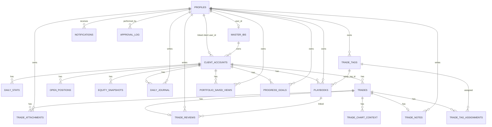

# Data Model

หน้านี้สรุป schema, ownership, RLS และ RPC ที่เป็นแกนหลักของระบบ โดยอ้างอิงจาก `supabase/migrations/*.sql`

## 1. Ownership Model

- `profiles.id` อ้างถึง `auth.users.id`
- `master_ibs.user_id` ชี้กลับไปยัง `profiles.id` ของ role `master_ib`
- `client_accounts.master_ib_id` ชี้ไปยังเจ้าของ IB
- `client_accounts.user_id` เป็น optional จนกว่าลูกค้าจะถูก approve และทำ Google linking สำเร็จ
- market/journal/review tables ส่วนใหญ่ยึด `client_account_id` หรือ `user_id` หรือทั้งคู่เป็นหลัก

ข้อกำหนดสำคัญ:

- `client_accounts` unique ที่ `(mt5_account_id, mt5_server)`
- `client_accounts.user_id` unique เมื่อไม่เป็น `NULL`
- approved email ถูกตรวจซ้ำแบบ normalized เพื่อป้องกันหลาย account ใช้อีเมลเดียวกัน

## 2. Table Catalog

### Identity / Access

| Table | หน้าที่ | ฟิลด์สำคัญ |
| --- | --- | --- |
| `profiles` | ขยายข้อมูลจาก `auth.users` | `role`, `full_name`, `avatar_url`, `telegram_chat_id`, `is_active` |
| `master_ibs` | domain record ของ IB | `user_id`, `ib_code`, `company_name`, `max_clients`, `is_active` |

### Onboarding / Workflow

| Table | หน้าที่ | ฟิลด์สำคัญ |
| --- | --- | --- |
| `client_accounts` | ระเบียนหลักของลูกค้าและบัญชี MT5 | `master_ib_id`, `user_id`, `client_email`, `mt5_account_id`, `mt5_investor_password`, `status`, `mt5_validated`, `sync_error` |
| `approval_log` | audit trail ของ workflow | `action`, `performed_by`, `previous_status`, `new_status`, `reason`, `metadata` |
| `notifications` | user-targeted notification feed | `user_id`, `type`, `title`, `body`, `is_read`, `metadata` |

### Market / Sync

| Table | หน้าที่ | ฟิลด์สำคัญ |
| --- | --- | --- |
| `daily_stats` | summary ต่อวันของบัญชี | `date`, `balance`, `equity`, `profit`, `win_rate`, `profit_factor`, `max_drawdown` |
| `trades` | closed trades | `position_id`, `symbol`, `type`, `lot_size`, `open_time`, `close_time`, `profit`, `pips`, `commission`, `swap` |
| `open_positions` | positions ที่ยังเปิดอยู่ | `position_id`, `symbol`, `current_price`, `current_profit`, `updated_at` |
| `equity_snapshots` | intraday snapshots ของ equity | `timestamp`, `balance`, `equity`, `floating_pl`, `margin_level` |
| `trade_chart_context` | stored chart bars รอบ trade | `trade_id`, `timeframe`, `window_start`, `window_end`, `bars` |

### Journal / Review / Portfolio UX

| Table | หน้าที่ | ฟิลด์สำคัญ |
| --- | --- | --- |
| `trade_tags` | reusable tags ต่อ user | `name`, `category`, `color` |
| `trade_tag_assignments` | many-to-many ระหว่าง trade กับ tag | `trade_id`, `tag_id` |
| `trade_notes` | note เดียวต่อ trade | `trade_id`, `user_id`, `content`, `rating` |
| `daily_journal` | pre/post-market journal ต่อวัน | `client_account_id`, `user_id`, `date`, `checklist`, `completion_status` |
| `playbooks` | setup/risk framework ของ client | `setup_tag_id`, `entry_criteria`, `exit_criteria`, `risk_rules`, `is_active` |
| `trade_reviews` | structured post-trade review | `trade_id`, `playbook_id`, `review_status`, `broken_rules`, `followed_plan` |
| `trade_attachments` | URL/path attachments ต่อ trade | `trade_id`, `kind`, `storage_path`, `caption`, `sort_order` |
| `portfolio_saved_views` | saved filters สำหรับ page reports | `page`, `name`, `filters` |
| `progress_goals` | target metrics ของ client | `goal_type`, `target_value`, `period_days`, `is_active` |

## 3. Entity Relationship Summary

หมายเหตุ:

- diagram นี้ intentionally แสดงเฉพาะ relationship สำคัญ ไม่ได้ใส่ทุก foreign key
- `trade_reviews` และ `trade_notes` เป็น one-record-per-trade ในเชิง constraint

## 4. RLS Summary by Actor

| Actor | การมองเห็นข้อมูลหลัก | หมายเหตุ |
| --- | --- | --- |
| Unauthenticated | ไม่มี access ไปยัง protected data | web app อนุญาตเฉพาะ public routes เช่น `/auth/login`, `/auth/callback` |
| `admin` | ได้สิทธิ์ RLS กว้างเกือบทุก table และบาง flow ใช้ service-role | admin pages หลายหน้าดึงข้อมูลผ่าน `createSupabaseServiceClient()` |
| `master_ib` | อ่าน/แก้เฉพาะ client ของตัวเอง, อ่าน market tables ของ client ตัวเอง, insert approval log บาง action | ownership helper หลักคือ `get_user_master_ib_id()` และ `is_own_client()` |
| `client` | อ่าน account ที่ link กับตัวเอง, market tables ของตัวเอง, จัดการ journal/review/playbook/tags/views/goals ของตัวเอง | browser notification access จำกัดด้วย `notifications.user_id = auth.uid()` |
| Bridge / service-role | bypass RLS ทุก table | trusted backend สำหรับ validation, sync, backfill, auth admin actions |

RLS helper functions หลัก:

- `get_user_role()`
- `get_user_master_ib_id()`
- `is_own_client(account_id uuid)`
- `is_own_account(account_id uuid)`
- `is_own_trade(p_trade_id uuid)`

## 5. DB Helper / RPC Summary

| Function | ประเภท | ใช้โดย | หน้าที่ |
| --- | --- | --- | --- |
| `handle_new_user()` | trigger function | Supabase Auth | สร้าง `profiles` row หลังมี user ใหม่ พร้อม normalize role และเก็บ Google avatar |
| `normalize_email(value)` | helper | migrations/RPC/OAuth | normalize email ให้ lower-case และ trim |
| `get_user_role()` | RLS helper | policies | อ่าน role ของ `auth.uid()` |
| `get_user_master_ib_id()` | RLS helper | policies | map `auth.uid()` ไปยัง `master_ibs.id` |
| `is_own_client(account_id)` | RLS helper | policies | ตรวจว่า account อยู่ใต้ Master IB คนปัจจุบันหรือไม่ |
| `is_own_account(account_id)` | RLS helper | policies | ตรวจว่า client account link กับ user ปัจจุบันหรือไม่ |
| `is_own_trade(p_trade_id)` | RLS helper | policies | ใช้กับ trade tags/review attachments |
| `sanitized_client_account_json(account_row)` | security helper | RPC responses | คืน JSON ที่ตัด `mt5_investor_password` ออก |
| `admin_transition_client_account(...)` | RPC | `/api/admin/approve` | approve/reject/suspend/reactivate พร้อม log และ notifications |
| `ib_resubmit_client_account(...)` | RPC | `/api/ib/clients/resubmit` | ส่ง rejected account กลับเป็น `pending` พร้อม MT5 creds ใหม่ |
| `admin_edit_client_account(...)` | RPC | `/api/admin/clients/edit` | admin แก้ client fields รวมถึง encrypted MT5 password |
| `ib_edit_client_account(...)` | RPC | `/api/ib/clients/edit` | IB แก้ basic client info เท่านั้น |
| `ib_cancel_client_account(...)` | RPC | `/api/ib/clients/cancel` | delete account ที่ `pending` หรือ `rejected` พร้อม log |
| `admin_delete_client_account(...)` | RPC | `/api/admin/clients/delete` | admin ลบ client account ทุกสถานะ พร้อม cascade |

## 6. Workflow Constraints ที่ DB บังคับ

- `admin_transition_client_account(...)`
  - approve/reject ได้เฉพาะ `pending`
  - suspend ได้เฉพาะ `approved`
  - reactivate ได้เฉพาะ `suspended`
  - approve จะ block ถ้า normalized client email ชนกับ approved/linked account อื่น
- `ib_resubmit_client_account(...)`
  - ใช้ได้เฉพาะ `rejected`
  - reset validation + review metadata ก่อนกลับไป `pending`
- `ib_edit_client_account(...)`
  - ห้ามแก้ account ที่ `suspended`
  - IB แก้ไม่ได้ทั้ง MT5 account/server/password
- `ib_cancel_client_account(...)`
  - cancel ได้เฉพาะ `pending` หรือ `rejected`
- `admin_delete_client_account(...)`
  - delete cascade ไปยัง market/journal/review tables ตาม foreign keys

## 7. Security Notes

### Service-role usage

- `createSupabaseServiceClient()` ใช้ใน admin dashboards, auth setup/reset, OAuth callback และ server-side operations บางส่วน
- bridge ใช้ service-role key ผ่าน `bridge-ib-portal/core.py`
- browser ไม่มี service-role key

### One Google user = one client account

- OAuth callback (`src/routes/auth/callback/+server.ts`) จะ:
  1. ตรวจว่ามี linked account อยู่แล้วหรือไม่
  2. หา approved account แรกที่ normalized email ตรงกันและยังไม่ link
  3. ถ้าไม่พบ จะลบ auth user แล้ว sign out
- migration `005_harden_client_linking_and_workflows.sql` เพิ่ม unique index ที่ `client_accounts(user_id)` และจัดการ duplicate links เดิม

### Encrypted MT5 password flow

- API ฝั่ง web ใช้ `src/lib/server/crypto.ts` encrypt รหัสผ่านด้วย AES-256-GCM ก่อนบันทึก
- bridge ใช้ `bridge-ib-portal/core.py::decrypt_password()` เพื่อ decrypt ก่อน login MT5
- response ฝั่ง browser ไม่ควร expose `mt5_investor_password` และ RPC sanitized response ช่วย enforce เพิ่มอีกชั้น

### Notification security

- `notifications` ใช้ RLS `user_id = auth.uid()` สำหรับ user เอง
- admin เพิ่มสิทธิ์ด้วย migration `002_fix_notification_rls.sql`
- browser notification bell subscribe Realtime เฉพาะ `user_id` ของตัวเอง

### Attachment model

- `trade_attachments.storage_path` เก็บ string URL/path เท่านั้น
- current repo ไม่มี object storage upload flow, signed URL flow หรือ file scanning pipeline
